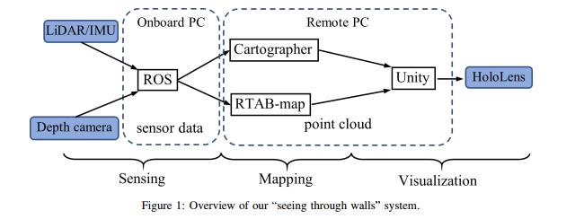
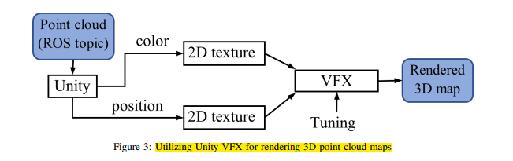
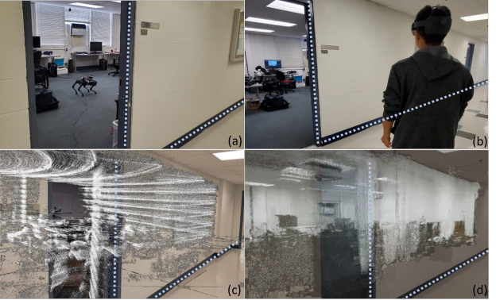

# 理解论文的核心贡献

1. 这论文研究问题是什么，解决了什么实际问题？
2. 论文中的系统或方法与现有技术相比有何不同或优势?
3. 论文的创新点是什么？是提出了新的方法、算法、模型，还是改进了已有的技术？

## 依据
(摘要)随着搜救任务中对态势感知需求的增加，在复杂建筑环境中对人类空间感知增强的系统变得越来越重要。 
(摘要)然而，仍需要证据来证明场景捕捉、3D 映射、渲染和可视化如何能够集成执行，从而实现即时的“数字双胞胎”建模。 
(摘要)我们的系统在一个实验室内进行了案例研究，结果生成了虚拟的周围环境，支持在遮挡区域进行搜救操作。 
(引言)在复杂建筑环境中增强专业工作人员的态势感知已被认为是提高各类工业工作（如建筑操作、设施维护和紧急响应等）绩效和安全性的关键因素，特别是，感知遮挡和封闭区域内物体的能力，如“透视墙壁”功能，对于某些专业人员（如搜救中的第一响应者）至关重要。 

(引言)尽管上述技术的发展使得将计算机视觉和增强现实 (AR) 集成用于视觉远程呈现成为可能，但目前仍有有限的案例报告能够实现整个工作流程管道。 
(引言)仍然存在许多问题，例如传感器与 SLAM 之间的兼容性、仿真逼真度、显示系统中的可视性，以及增强现实 (AR) 设备中用户界面 (UI) 的交互性。由于每个系统的高度专业化，单个系统之间的差距可能会进一步扩大。 
(引言)系统的容量、鲁棒性和灵活性依赖于精心设计的工作流程、精挑细选的组件以及顺畅的通信。 
(引言)本文提出了一种系统，将 LiDAR、3D SLAM、Unity 引擎和增强现实 (AR) 集成在一起，用于测试生成“透视墙壁”功能的综合工作流程，旨在应用于搜救任务。 

## 总结
1. 背景意义: 在复杂建筑环境中增强专业工作人员的态势感知已被认为是提高各类工业工作（如建筑操作、设施维护和紧急响应等）绩效和安全性的关键因素，特别是，感知遮挡和封闭区域内物体的能力，如“透视墙壁”功能，对于某些专业人员（如搜救中的第一响应者）至关重要。

2. 实际问题：随着搜救任务中对态势感知需求的增加，如何增强在复杂建筑环境中人类的空间感知

3. 现有技术：
    - 尽管上述技术的发展使得将计算机视觉和增强现实 (AR) 集成用于视觉远程呈现成为可能，但目前仍有有限的案例报告能够实现整个工作流程管道。仍需要证据来证明场景捕捉、3D 映射、渲染和可视化如何能够集成执行，从而实现即时的“数字双胞胎”建模。
    - 系统的容量、鲁棒性和灵活性依赖于精心设计的工作流程、精挑细选的组件以及顺畅的通信。传感器与 SLAM 之间的兼容性、仿真逼真度、显示系统中的可视性，以及增强现实 (AR) 设备中用户界面 (UI) 的交互性。由于每个系统的高度专业化，单个系统之间的差距可能会进一步扩大。

4. 创新: (说白了就是没人证明将这些流程结合起来的系统是可以执行的,所以我推出一个系统来证明可行性)
    - 本文提出了一种系统，将 LiDAR、3D SLAM、Unity 引擎和增强现实 (AR) 集成在一起，用于测试生成“透视墙壁”功能的综合工作流程，旨在应用于搜救任务。
    - 我们的系统在一个实验室内进行了案例研究，结果生成了虚拟的周围环境，支持在遮挡区域进行搜救操作。

# 理解论文的结构和逻辑

1. 作者为何要做这个研究，已有的研究进展如何，以及存在的研究空白或挑战
2. 作者提出的解决方案。这里要关注他们的技术路线、算法原理、模型结构等。
3. 作者如何验证其方法，实验设计如何与目标相匹配，实验结果是否支持他们的假设。
4. 作者如何总结研究工作并提出未来的研究方向

## 依据
(相关工作)一项研究方向集中在基于室内定位估计创建空间模型。通过使用带有光学传感器的无线电标签进行定位和警报。人的位置或机器人的位置是相对于这些标签确定的，平均误差小于 0.3 米 
(相关工作)雷达波和WIFI信号来穿透墙壁，用来探测墙对面隐藏的人，这些方法依赖于能够穿透障碍物的信号，生成的可视效果基于推测。 
(相关工作)尽管在遮挡区域的传感和可视化方面取得了进展，现有的努力大多集中在提高定位和跟踪精度的方法，或是将已建立的模型单独可视化，而不是从扫描到 UI/UX 解决方案的集成过程 

(系统设计)点云模型可以在数据生成的过程中定期推送到 AR 眼镜中。由于模型可能非常大，通常带宽不足以实时流式传输传感器或 SLAM 的数据，因此我们的解决方案仅支持重建场景模型的伪实时刷新，刷新频率为每 10 秒一次。 
(系统设计)与相机相比，使用旋转式 3D LiDAR 可以减少快速扫描房间所需的时间。在搜救场景中，可能没有足够的时间将相机移动到不同的视角。虽然我们的地图是无色的，但形状、距离和地标位置仍然可以通过单色图像清晰地传达给用户。 

(系统设计)对于姿态传感器，我们仅限于使用 IMU。LiDAR 系统的 3D SLAM 需要 IMU 数据来解释重力方向，这对在具有六自由度的空间中匹配子地图至关重要。由于 IMU 是机器人姿态的唯一来源，因此 IMU 的准确性和稳定性非常重要，必须避免随时间漂移。 

(系统设计)Cartographer 已经证明了其在长距离轨迹构建能力和精度上的优势，尤其是在没有 GPS 和视觉里程计支持的室内映射中,但是由于其固有特性，可能会出现问题：地图构建过程只有在软件完成处理扫描数据并执行闭环修正后才完成。因此，从 LiDAR 获取的地图只能在一段时间后提取，这是其精度的权衡。而且，从 LiDAR 传感器流出的数据密度过大，无法通过无线设备进行传输。因此，LiDAR 扫描作为环境的快速第一手反馈。 

(系统设计)深度相机的特性与 LiDAR 传感器互为补充。由于其深度测量方式，深度相机只能在较近的范围内（2 米内）工作，以获得更好的成像和映射质量。 

(系统设计)跟踪主要是在 Unity 中进行的。通过手动校准，标记头戴设备在物理空间中的起始位置和方向，并将数字模型的头戴设备移动到与之匹配的位置和方向。一旦环境被渲染并启动仿真，Unity 定位系统将用于参考真实和虚拟空间中的物体。摄像头的运动由头戴设备本身跟踪。在 Unity 中，与 HoloLens 2 头戴设备的位置、方向和大小相关联的摄像头会跟随 HoloLens 2 的物理运动，从而精确地呈现其周围的运动和空间。 

(系统设计)通过使用 velodyne_driver ROS 包和以太网电缆，每 10 秒钟记录 108 条 PointCloud2 消息，生成了一个 48.3 MB 的 .bag 文件，方便后续重用。我们使用修改后的 .launch、.lua 和 urdf 文件对静态数据进行 SLAM。即使在硬件性能较弱的计算机上，Cartographer 也足够快速和高效，几秒钟内即可完成 SLAM。一旦轨迹完成，Cartographer 会收到停止信号，并将状态写入 .pbstream 文件。Cartographer 的资产写入器用于生成 .xyz 点云文件。构建完基于 LiDAR 扫描数据的整体空间模型后，地面机器人根据 SLAM 自主导航功能导航到目标区域（目标点由操作员定义）。然后使用 Azure 摄像头收集更多的纹理和颜色信息进行网格化。最终，从 LiDAR 扫描器和深度摄像头获得的点云模型被传输到 Unity 中进行渲染，然后在 HoloLens 2 头显中显示。

(系统设计)来自 LiDAR 的点云非常密集，因此扫描时间被限制为 3 秒，这已经足以展示大型物体的形状。 

(系统设计)3D 模型能够完美地对齐到墙壁上，但很难看出细节。另一方面，图 5(d) 显示的深度摄像头结果帮助我们理解墙后面的物体，但这些物体大多发生了错位。 

(结论)未来的工作将主要集中在两个方面：自动化和界面。本文设计的系统仍然需要人工执行和配置AR视图对齐。未来的方向将是通过计算机视觉方法自动化对齐步骤，无需人工干预。通过简化系统执行步骤，使其变得更加简洁，系统将能够被更多用户使用。另一个未来的开发方向是界面。随着系统流程的完成，设计一个直观的界面对于用户至关重要。这样不仅能有效地帮助用户识别关键信息，还将扩展其应用场景，涵盖更多使用情境。 

## 总结
1. 现有技术： 前面的研究一方面集中在基于室内定位估计创建空间模型，另一方面采用可以穿透障碍物的信号来可视化，可视效果基于推测。尽管在遮挡区域的传感和可视化方面取得了进展，现有的努力大多集中在提高定位和跟踪精度的方法，或是将已建立的模型单独可视化，而不是从扫描到 UI/UX 解决方案的集成过程。
2. 未来的工作将主要集中在两个方面：自动化和界面。本文设计的系统仍然需要人工执行和配置AR视图对齐。未来的方向将是通过计算机视觉方法自动化对齐步骤，无需人工干预。通过简化系统执行步骤，使其变得更加简洁，系统将能够被更多用户使用。另一个未来的开发方向是界面。随着系统流程的完成，设计一个直观的界面对于用户至关重要。这样不仅能有效地帮助用户识别关键信息，还将扩展其应用场景，涵盖更多使用情境。 

## 关注系统设计与实现

- 机器人选择UGV(导航通过快速探索随机树（RRT）算法实现自动化)
- 无色地图SLAM从雷达点云扫描和IMU位姿信息合成环境地图(Velodyne Puck LiDAR || Xsens MTi-670
IMU )
- 彩色地图则使用视觉里程计并且完全依赖于传感器的RGB-D数据(Kinect 2)。
- 在ros中完成建图(Cartographer)或者(RTAB-map)，
- 将点云数据发送到unity渲染3D模型
    导入点云模型，格式为 Pointcloud2.msg。
    根据指定的颜色和位置，为点云模型中的每个点创建粒子(VFX)
    渲染这些粒子，并为其指定合适的方向、大小和材质
- 通过 WiFi 将其传输到 HoloLens 2。（10秒AR更新一次)

